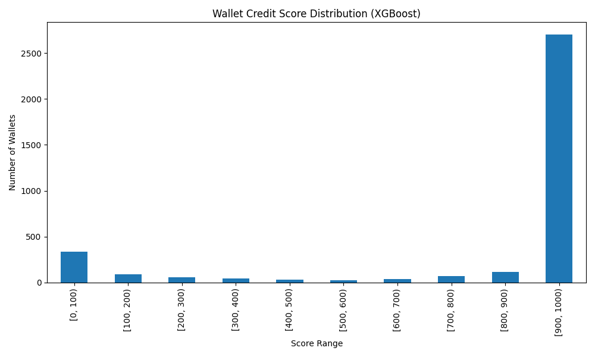
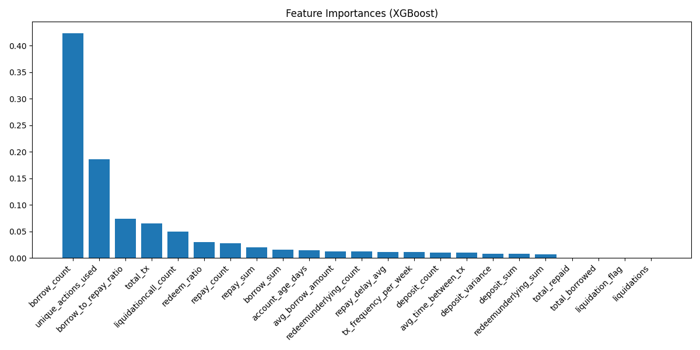

# Wallet Score Analysis (XGBoost)

## Score Distribution

### Score Ranges
- [0, 100): 334 wallets
- [100, 200): 90 wallets
- [200, 300): 59 wallets
- [300, 400): 40 wallets
- [400, 500): 30 wallets
- [500, 600): 25 wallets
- [600, 700): 34 wallets
- [700, 800): 70 wallets
- [800, 900): 111 wallets
- [900, 1000): 2703 wallets

## Feature Importances

- borrow_count: 0.424
- unique_actions_used: 0.186
- borrow_to_repay_ratio: 0.074
- total_tx: 0.065
- liquidationcall_count: 0.050
- redeem_ratio: 0.030
- repay_count: 0.028
- repay_sum: 0.020
- borrow_sum: 0.016
- account_age_days: 0.015
- avg_borrow_amount: 0.013
- redeemunderlying_count: 0.012
- repay_delay_avg: 0.012
- tx_frequency_per_week: 0.011
- deposit_count: 0.010
- avg_time_between_tx: 0.010
- deposit_variance: 0.008
- deposit_sum: 0.008
- redeemunderlying_sum: 0.007
- total_repaid: 0.000
- total_borrowed: 0.000
- liquidation_flag: 0.000
- liquidations: 0.000

## Behavioral Insights
- **Low-score wallets (<300):** Tend to have low repayment ratios, frequent liquidations, short account age, or bot-like activity.
- **High-score wallets (>800):** Show high repayment, long account age, few/no liquidations, and balanced borrow/deposit behavior.
- Total wallets: 3497
- Mean score: 839.09
- Median score: 999.00
- Std dev: 324.63
